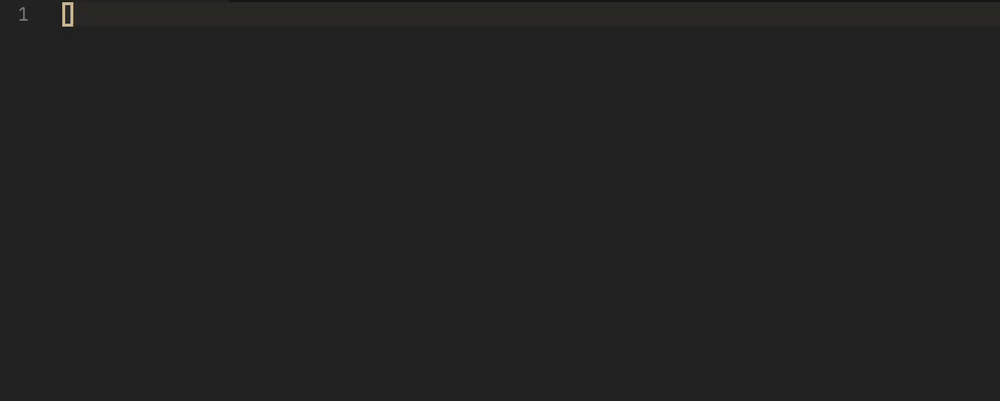

# corridor.nvim

AI-powered inline code completion for Neovim. Shows ghost-text suggestions as you type using Fill-in-the-Middle (FIM) completions from local or remote AI models.



## Features

- Ghost text suggestions rendered inline as you type
- Fill-in-the-Middle (FIM) completions using both prefix and suffix context
- Multiple provider support: **LM Studio** (local, OpenAI-compatible) and **Codestral** (Mistral FIM API)
- FIM token presets for StarCoder, CodeLlama, DeepSeek, Qwen, and Codestral model families
- Intelligent debouncing and stale request cancellation
- Mid-line awareness - truncates to single-line suggestions when cursor is mid-line
- Configurable context window with asymmetric 70/30 split (more context before cursor)
- Accept (`<Tab>`) and dismiss (`<S-Tab>`) keymaps with fallback to default behavior

## Requirements

- Neovim >= 0.10
- [plenary.nvim](https://github.com/nvim-lua/plenary.nvim)

## Installation

Using [lazy.nvim](https://github.com/folke/lazy.nvim):

```lua
{
  "orellazri/corridor.nvim",
  dependencies = { "nvim-lua/plenary.nvim" },
  config = function()
    require("corridor").setup()
  end,
}
```

## Configuration

All options with their defaults:

```lua
require("corridor").setup({
  -- Enabled by default
  enabled = true,

  -- AI provider: "lmstudio" or "codestral"
  provider = "lmstudio",

  -- API endpoint URL
  endpoint = "http://localhost:1234/v1/completions",

  -- Model name
  model = "qwen/qwen3-coder-30b",

  -- API key (falls back to CORRIDOR_API_KEY env var)
  api_key = nil,

  -- Debounce delay in ms before sending a request
  debounce_ms = 250,

  -- Max tokens in completion response
  max_tokens = 128,

  -- Sampling temperature
  temperature = 0.2,

  -- Keymap to accept a suggestion
  accept_keymap = "<Tab>",

  -- Keymap to dismiss a suggestion
  dismiss_keymap = "<S-Tab>",

  -- Filetypes to exclude (list or map)
  exclude_filetypes = {},

  -- Context window: 0 = full buffer, N = limit to N lines
  max_context_lines = 0,

  -- FIM tokens (defaults to Qwen tokens)
  fim = {
    prefix = "<|fim_prefix|>",
    suffix = "<|fim_suffix|>",
    middle = "<|fim_middle|>",
  },

  -- Stop sequences (auto-derived from FIM tokens if not set)
  stop = nil,
})
```

## Usage

Once installed and configured, corridor activates automatically in insert mode. As you type, it fetches AI completions and displays them as ghost text.

- **Accept** a suggestion: `<Tab>` (configurable)
- **Dismiss** a suggestion: `<S-Tab>` (configurable)

When no suggestion is visible, the keymaps fall through to their normal behavior.

### Commands

- `:CorridorEnable` - Enable completions (enabled by default after setup)
- `:CorridorDisable` - Disable completions globally (clears active suggestions)

Also available as Lua functions: `require("corridor").enable()` and `require("corridor").disable()`.

### Providers

**LM Studio** (default) - connects to a local LM Studio instance (or any OpenAI-compatible completions endpoint):

```lua
require("corridor").setup({
  provider = "lmstudio",
  endpoint = "http://localhost:1234/v1/completions",
  model = "qwen/qwen3-coder-30b",
})
```

**Codestral** - connects to the Mistral FIM API:

```lua
require("corridor").setup({
  provider = "codestral",
  endpoint = "https://codestral.mistral.ai/v1/fim/completions",
  model = "codestral-latest",
  api_key = "your-api-key", -- or set CORRIDOR_API_KEY env var
})
```
